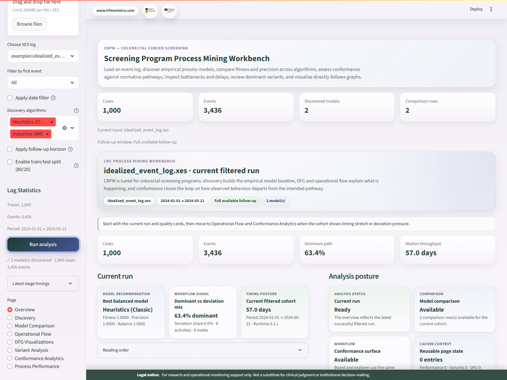
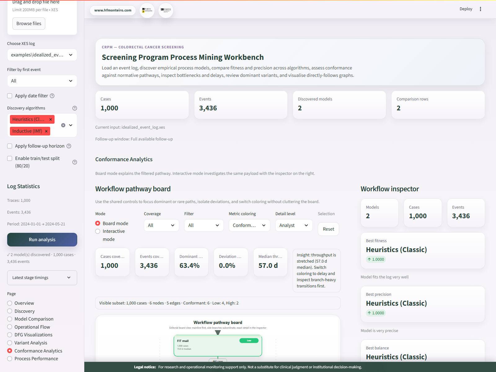
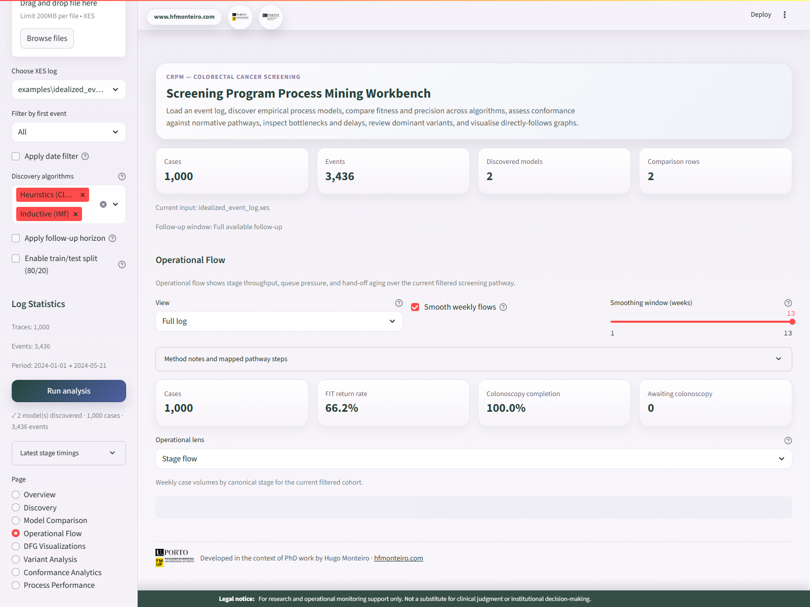

# CRPM

[](https://www.python.org/)
[](https://www.gnu.org/licenses/gpl-3.0)

CRPM is a process mining workbench for colorectal cancer screening pathways, built with [PM4Py](https://pm4py.fit.fraunhofer.de/) and [Streamlit](https://streamlit.io/). It is designed for research and operational monitoring teams who need discovery, model comparison, conformance analysis, DFG views, variant analysis, and timing-focused process diagnostics in one local application.

Developed in the context of PhD research at the **Faculty of Medicine, University of Porto (FMUP)**. Author: [Hugo Monteiro](https://hfmonteiro.com).

> **Legal notice** - For research and operational monitoring support only. Not a substitute for clinical judgment or institutional decision-making.

## Screenshots







## Quick Start

```bash
git clone https://github.com/HFMonteiro/CRPM.git
cd CRPM

python -m venv .venv
.venv\Scripts\activate        # Windows
# source .venv/bin/activate   # Linux / macOS

pip install .
python -m crpm.preflight
streamlit run app.py
```

`app.py` is the supported entrypoint.

## What CRPM Includes

- `Overview` for executive summary, run posture, and reading order
- `Discovery` and `Model Comparison` for Petri net discovery and quality tradeoffs
- `Operational Flow`, `DFG Visualizations`, and `Process Performance` for pathway movement, bottlenecks, and timing
- `Variant Analysis` for dominant and rare trace structure
- `Conformance Analytics` for token-based diagnostics, SVG workflow boards, and interactive workflow exploration
- local XES and CSV ingestion through the Streamlit shell

## Sample Data

The public sample bundle lives in `examples/`:

- `running-example.xes` - small didactic baseline log
- `screening_conformance_demo.xes` - main synthetic CRC screening demo log
- `screening_conformance_demo.csv` - event-level CSV companion for onboarding and validation
- `idealized_event_log.xes` and `idealized_petri_net.pnml` - idealized reference artefacts for conformance-oriented checks

The bundled `screening_conformance_demo.*` files are **synthetic** and intentionally shaped to expose dominant and rare pathways, deviations, PRE/POST drift, and timing bottlenecks.

You can generate a fresh synthetic screening log for experiments without replacing the bundled sample:

```bash
crpm-generate-screening-demo --cases 120 --seed 42 --csv outputs/synthetic_screening.csv --xes outputs/synthetic_screening.xes
```

## Data Quality and Timestamp Policy

CRPM treats XES and CSV inputs as sensitive health-adjacent operational data. CSV onboarding requires distinct case, activity, and timestamp columns. Null or blank case IDs, activities, or timestamps are rejected before PM4Py conversion, and mixed timezone-aware/timezone-naive CSV timestamps are rejected because they make waiting-time interpretation unsafe.

After a log is accepted, CRPM reports non-blocking event-log quality diagnostics in the run manifest and Overview: required-field completeness, duplicate event groups, same-timestamp bursts, decreasing timestamps, timestamp granularity, semantic profile fit, and preprocessing impact from source log to filtered/evaluation cohort. Semantic profiles are advisory only; `generic`, `healthcare`, and `ccr_screening` diagnostics should guide data cleanup without preventing generic process-mining use.

The v3 process-intelligence summaries also include privacy-preserving resource posture when a resource column exists. Resource names are aliased in summaries, while Conformance Analytics reports root-cause counts for model-deviation activities, log-deviation transitions, high-delay transitions, and deviating traces without exposing raw case identifiers.

Discovery and conformance runs now record explicit PM4Py method profiles: discovery tables and manifests include the selected algorithm profile and PM4Py variant, while conformance summaries document the alignment-first diagnostic policy with token replay retained as the fast screening posture. PNML helpers support path-redacted model inspection and export round-trip checks for interoperability.

Process-map payloads now share a common internal contract across DFG and Conformance renderers: schema version, map kind, renderer role, explicit denominators, KPI rows, and a safe selection context. This keeps the Streamlit SVG/HTML renderers aligned while preparing a future custom process-map renderer without changing PM4Py analytics.

## Headless Batch Config

CRPM can validate or run a local analysis from a JSON/YAML config without launching Streamlit:

```bash
crpm-analyze --config config.json --dry-run
crpm-analyze --config config.json
```

Minimal XES example:

```json
{
  "source": {
    "type": "xes",
    "path": "examples/screening_conformance_demo.xes"
  },
  "analysis": {
    "workflow_cohort_policy": "first_event_direct",
    "start_filter": "Invitation",
    "selected_algorithms": ["Inductive (IMf)"]
  },
  "governance": {
    "privacy_mode": "restricted_health_adjacent",
    "domain_template": "ccr_screening"
  },
  "output": {
    "directory": "outputs/batch-run"
  }
}
```

The first-event direct workflow remains the production default. Use a concrete `start_filter` for production runs; `All` is only valid with explicit follow-up anchor mode for secondary sensitivity work.

Supported privacy modes are `public_demo`, `internal_operational`, and `restricted_health_adjacent`. Supported domain templates are `ccr_screening` and `generic`. These fields document governance posture in the manifest; they do not convert CRPM into clinical decision support or weaken the default redaction posture.

See `docs/governance.md` for the public governance notes behind these modes.

## Future Readiness

Run manifests include lightweight cache telemetry and stage timings so local runs can be audited without exposing cache keys or records. Cache telemetry reports bounded cache names, entry counts, configured limits, utilization, and runtime totals.

DuckDB/Parquet is an optional future staging track for larger CSV logs. It is not a required dependency and is not part of the default install path.

OCEL 2.0 is an experimental future track for object-centric process mining. The current CRPM production workflow remains case-centric CCR screening with `first_event_direct` as the default discovery mode.

## Requirements

- Python `3.10+`
- [Graphviz](https://graphviz.org/download/) available on `PATH` for DFG and Petri net rendering

```bash
# Ubuntu / Debian
sudo apt-get install -y graphviz

# macOS
brew install graphviz
```

On Windows, install Graphviz from the official installer and add `dot` to `PATH`.

## Development

```bash
pip install -e ".[dev]"
pytest -q
ruff check crpm tests
```

## Citation

```bibtex
@software{monteiro2026crpm,
  author    = {Monteiro, Hugo F.},
  title     = {{CRPM}: Colorectal Cancer Screening Process Mining Workbench},
  year      = {2026},
  url       = {https://github.com/HFMonteiro/CRPM},
  license   = {GPL-3.0}
}
```

## License

This project is licensed under the [GNU General Public License v3.0](LICENSE).
